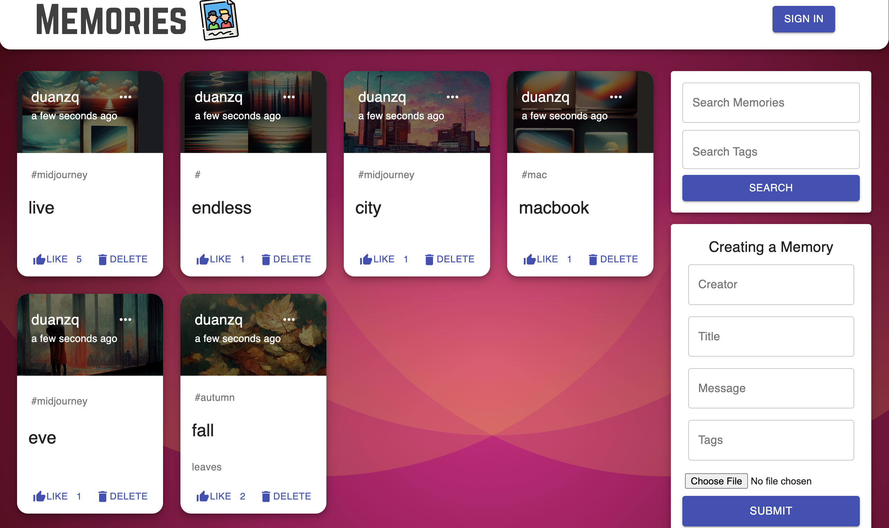
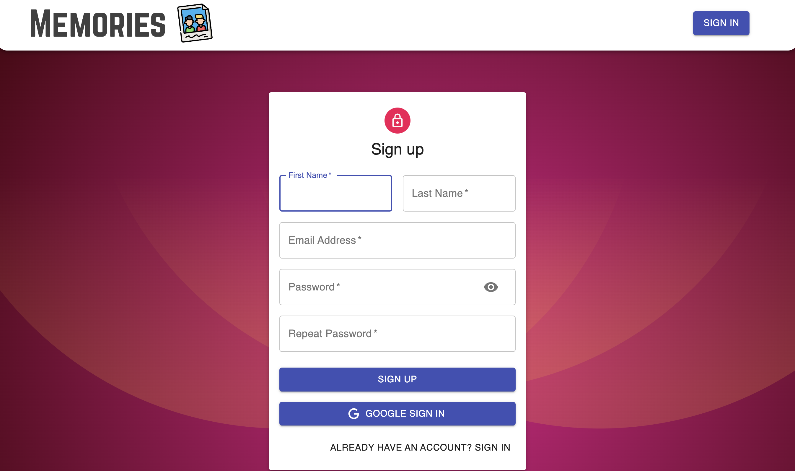

## Full Stack Website: Online Story Cards

Built a full stack website with responsive home and search function using MongoDB, Node.js, and React.

Implemented login system to allow CRUD operations (post, delete, like) and deployed on Heroku and Netlify.

### Features

- Responsive home page
- Search function
- Login system for user management
- CRUD operations (post, delete, like)
- Deployment on Heroku and Netlify

### Technologies

- MongoDB
- Node.js
- React
- Heroku
- Netlify

View the website [here](https://mern-memory-duanzq.netlify.app/).

